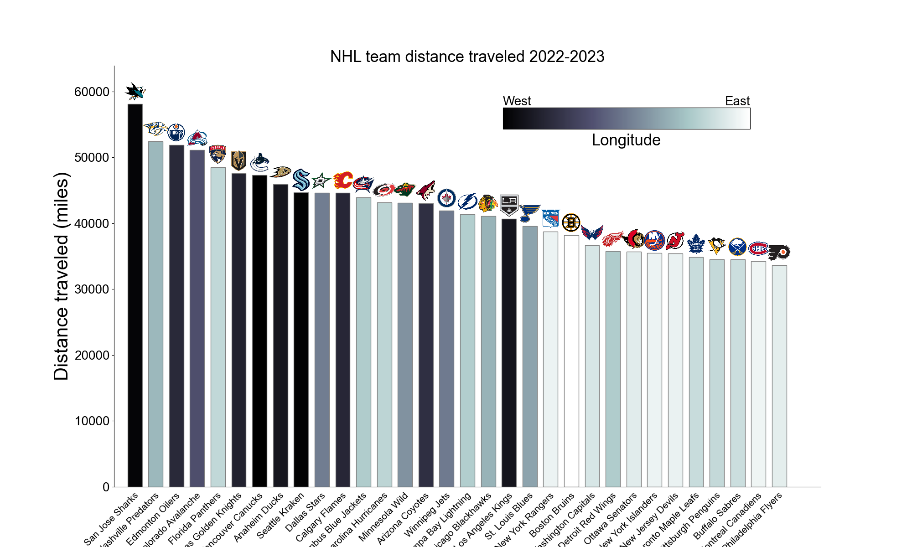

# nhl-distance-traveled
Short notebook to calculate and display the distance traveled for each NHL team for a given season. An example of the resulting bar plot is shown below for the 2022-2023 season. Always an interesting statistic to look at, although it's been shown to have little effect on team performance over the course of a season. Please let me know if you have any questions or comments.

  

