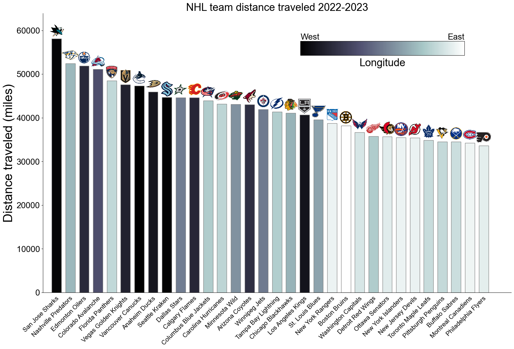

# nhl-distance-traveled
Short notebook to calculate and display the distance traveled for each NHL team for a given season. An example of the resulting bar plot is shown below for the 2022-2023 season. Always an interesting statistic to look at, although it's been shown to have little effect on team performance over the course of a season. There is also an interactive Streamlit app located here: https://pwcauley-nhl-distance-travel-nhl-team-distance-streamlit-1ut0at.streamlit.app/.
Some of the important assumptions in the calculation are:
1. Teams go directly from their current city to the city of their next game. In other words, they don't return home between road games. This is not strictly true for many of the northeast teams that are geographically clustered but it's almost impossible to get their exact travel schedule so it's not a bad approximation.
2. Distances are great-circle distances, i.e., we are not calculating the road distance of trips that could be by bus.
3. We ignore international games before 2023 because there is no easily obtainable location information on hockey-reference.com for the NHL Global Series before this year.

Please let me know if you have any questions or comments.

  

